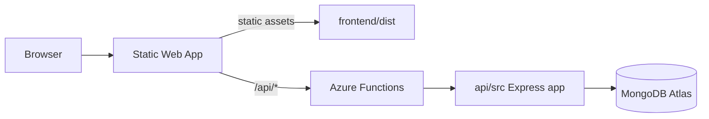

# Azure Deployment: Static Web Apps + API Functions

| Layer | Azure service | Folder |
|--------|----------------|--------|
| Frontend (React/Vite) | **Azure Static Web Apps** | `frontend/` |
| Backend (Express + MongoDB) | **Azure Functions** (linked to SWA) | `api/` |

The browser calls **`/api/*`** on the same SWA hostname. SWA proxies those requests to the Node function running the Express app.

## Architecture



## CI/CD

Workflow: `.github/workflows/azure-static-web-apps-polite-bay-08b90600f.yml`

On push to `dev`:

1. Builds `frontend/dist` (`npm run build:qa`)
2. Verifies `api/` compiles (`npm run build`)
3. Deletes `node_modules` (avoids SWA **15,000 file limit**)
4. Deploys `frontend/dist` + `api/` source; Azure Oryx builds the API (`skip_api_build: false`)

## Azure Portal: application settings

**Static Web App → Settings → Environment variables:**

| Name | Notes |
|------|--------|
| `MONGODB_URI` | Atlas connection string |
| `MONGODB_DB` | e.g. `fifaPrediction` |
| `JWT_SECRET` | Long random secret |
| `JWT_EXPIRE` | `7d` |
| `GOOGLE_CLIENT_ID` | Web client ID |
| `GOOGLE_CLIENT_IDS` | Same ID (comma-separated if multiple) |
| `NODE_ENV` | `production` |
| `FRONTEND_URL` | Your SWA URL |
| `RATE_LIMIT_WINDOW_MS` | `900000` |
| `RATE_LIMIT_MAX_REQUESTS` | `1000` |

## Local development

```bash
# API (Express on :5001)
cd api && npm install && cp .env.example .env   # edit .env
npm run dev

# Frontend (Vite proxies /api → :5001)
cd frontend && npm install && npm run dev
```

**Azure Functions locally** (optional):

```bash
cd api && cp local.settings.json.example local.settings.json
npm run start:functions   # requires Azure Functions Core Tools
```

## Database

```bash
cd api
npm run seed:mongo              # teams + matches
npm run migrate:app-to-users    # one-time legacy `app` → `users`
```

Collections: `users`, `teams`, `matches`.

## Troubleshooting

| Issue | Fix |
|-------|-----|
| API 404 on SWA | Confirm workflow `api_location: api` and API build step passed |
| API **500** on `/api/*` | Open `https://<your-swa>/api/health` — if `mongo.ok` is false, fix `MONGODB_URI`, `MONGODB_DB`, Atlas **Network Access** (allow `0.0.0.0/0` for test), redeploy |
| MongoDB errors | Check `MONGODB_URI` / `MONGODB_DB` in SWA settings; Atlas IP allowlist |
| Google login | `FRONTEND_URL` + Google Console authorized origins = SWA URL |
| Local API fails | `api/.env` present; `PORT=5001` matches Vite proxy in `frontend/vite.config.ts` |
